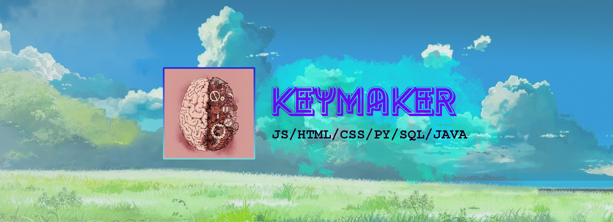
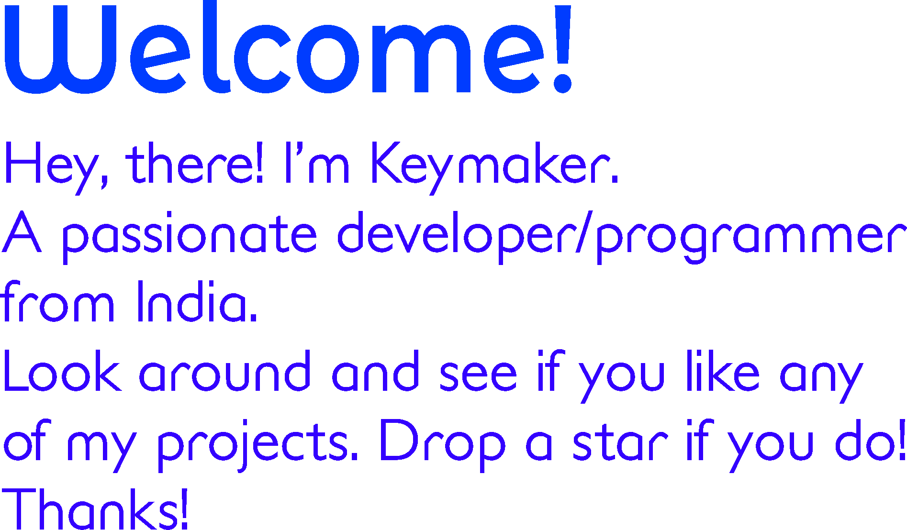

  

 

 

  &nbsp;&nbsp;&nbsp;&nbsp;
  

 
 

   
  &nbsp;&nbsp;&nbsp;&nbsp;
  

  &nbsp;&nbsp;&nbsp;&nbsp;
  

<h2>Skills Stack</h2>

  <h3>Languages</h3>
  

      
      
      
      
      
      
      
      
      
      
      
      
      
  

  <h3>Testing Suites</h3>

  

      
       
      
  

  <h3>Databases</h3>

  

      
      
      
  

  <h3>Frameworks</h3>

  

      
      
      
       
      
      
  

  <h3>Package Managers</h3>

  
  
      
      
      
      
      
  

  <h3>Softwares</h3>

  

      
      
      
       
       
      
      
       
      
      
      
      
      
       
       
      
      
      
      
      
      
      
      
      
      
      
      
      
      
  

  <h3>Version Controls</h3>

  

      
      
  

  <h3>Deployed In</h3>

  

      
      
  

  

  

<h3>Note:</h3>
<ul>
<li>
The above statistics doesn't signify my skill level. It's just as mentioned before, i.e. the above data is a visual representation of my github account activity.
</li>
</ul>

